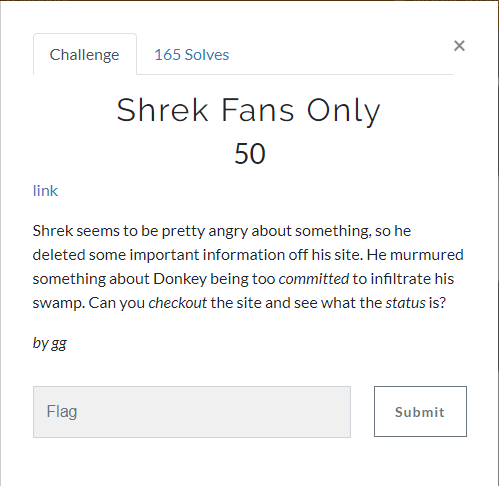
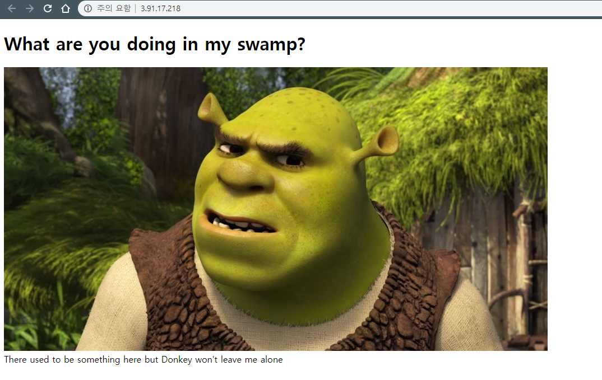
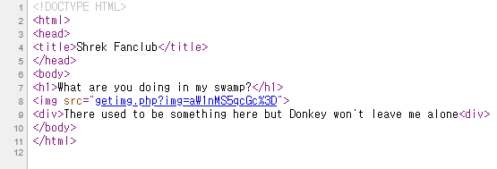
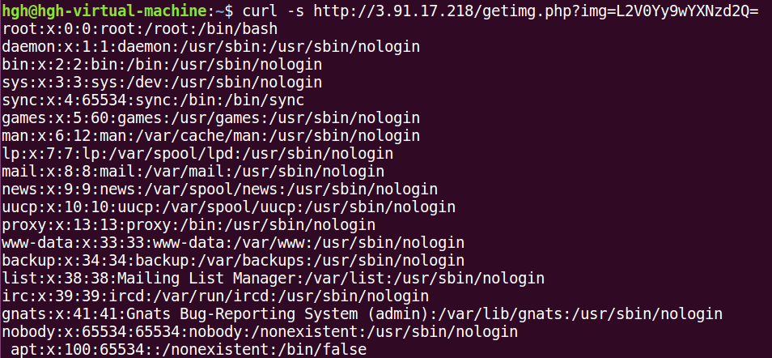
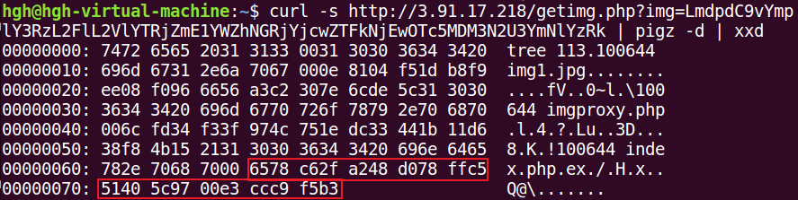
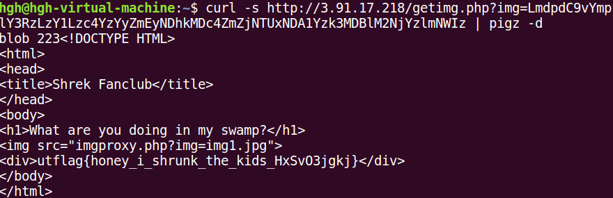

# Shrek-Fans-Only
> ## Overview  

  
링크로 들어가면 아래와 같은 페이지가 나온다.  

  

  

슈렉 이미지는 getimg.php 페이지에서 base64형태로 인코딩되어 이미지 파일의 이름이 입력되어있다.  
이를 이용해 LFI가 가능하여 passwd 파일을 읽을 수 있었다.

  

이후에 FLAG가 있을만한 여러파일을 뒤적거리다 포기......  
그 와중에 .git 폴더를 발견하여 여러가지 뒤적거려 봤지만  
git 구조에 대한 지식이 없고 해볼 생각을 안하고 그냥 넘어갔다 ㅡㅡ  
답을 보고 풀었다.  commit을 보고 blob?? 을 찾아서 요청을 보내면 된당.
  

  

