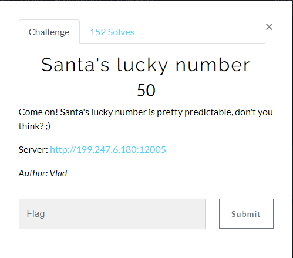
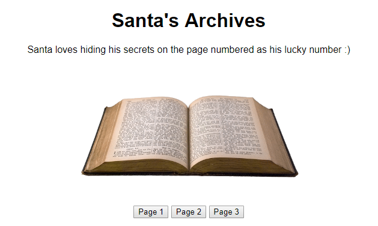
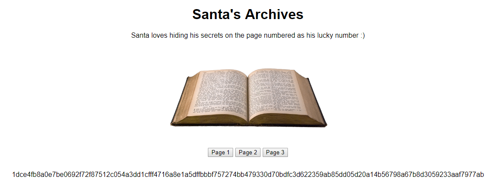
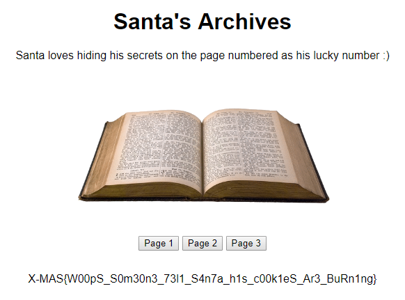

# Santa's luck number

그림처럼 page 버튼이 3개가 존재하고 있다.

버튼을 클릭하면 암호화된 값들이 출력이 된다.

이외에 다른 곳에 단서는 없다.

조작가능한 입력값은 page 파라미터가 존재한다.

0, -1, 문자등을 넣어도 암호화된 값들이 출력된다.

문제를 다시보니 산타의 비밀 숫자?를 찾아내야 하는것 같다.

burp intruder를 통해 page 파라미터를 순차적으로 증가시켜보니 flag가 출력된다.

